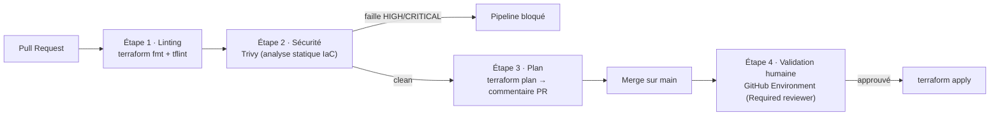

#  Pipeline CI/CD DevSecOps — Terraform Automation

[](https://github.com/toriyama237/terraform-devsecops-pipeline/actions/workflows/terraform-ci.yml)
[](LICENSE)
[](https://www.terraform.io/)
[](https://trivy.dev/)

---

##  Le pipeline en 4 étapes



| # | Étape | Outil | Rôle | Fichier |
| - | ----- | ----- | ---- | ------- |
| 1 | **Linting** | `terraform fmt`, `tflint` | Garantit un code formaté et conforme aux bonnes pratiques | [`terraform-ci.yml`](.github/workflows/terraform-ci.yml) |
| 2 | **Sécurité** | `Trivy` | Analyse statique : **bloque** le déploiement si une faille est détectée (port ouvert, bucket public, chiffrement manquant…) | [`terraform-ci.yml`](.github/workflows/terraform-ci.yml) |
| 3 | **Planification** | `terraform plan` | Génère le plan et le **publie automatiquement dans la Pull Request** | [`terraform-ci.yml`](.github/workflows/terraform-ci.yml) |
| 4 | **Validation humaine** | GitHub Environments | Attend l'**approbation d'un administrateur** avant `terraform apply` | [`terraform-apply.yml`](.github/workflows/terraform-apply.yml) |

---

##  Structure du dépôt

```
.
├── .github/workflows/
│   ├── terraform-ci.yml        # PR : lint → sécurité → plan → commentaire
│   └── terraform-apply.yml     # main : apply gated par approbation humaine
├── infra/                      # Module racine (VPC sécurisée + bucket S3 durci)
│   ├── versions.tf
│   ├── providers.tf
│   ├── variables.tf
│   ├── main.tf
│   ├── outputs.tf
│   └── terraform.tfvars.example
├── modules/secure-network/     # Module réseau réutilisable et durci
│   ├── main.tf                 # VPC + Flow Logs (KMS) + Security Group restreint
│   ├── variables.tf
│   ├── outputs.tf
│   └── versions.tf
├── .tflint.hcl                 # Règles de linting
├── .trivyignore                # Exceptions de sécurité documentées et justifiées
├── Makefile                    # Rejoue le pipeline en local
└── README.md
```

---

## Sécurité intégrée (Shift-Left)

L'infrastructure d'exemple est **durcie par défaut** :

- **VPC** avec *Flow Logs* chiffrés (KMS, rotation activée) pour l'audit réseau.
- **Security Group** : SSH **restreint** à des plages de confiance — jamais `0.0.0.0/0`.
  Une `validation` Terraform interdit même explicitement l'ouverture au monde entier.
- **Security Group par défaut verrouillé** (aucun trafic autorisé).
- **Bucket S3** : chiffrement SSE-KMS, *versioning*, blocage des accès publics,
  cycle de vie et **politique refusant tout trafic non-HTTPS** (`aws:SecureTransport`).

Le scan **Trivy** s'exécute à chaque PR. **Toute faille HIGH/CRITICAL bloque le pipeline.**
Les rares exceptions sont centralisées et **justifiées** dans [`.trivyignore`](.trivyignore).

> Pour voir la porte de sécurité en action : ajoutez une règle d'ingress
> `cidr_ipv4 = "0.0.0.0/0"` sur le port 22 dans le module et ouvrez une PR.
> Trivy détectera la faille et **refusera le déploiement**.

---

## Utilisation locale

Prérequis : [Terraform](https://developer.hashicorp.com/terraform/install) ≥ 1.6,
[TFLint](https://github.com/terraform-linters/tflint), [Trivy](https://trivy.dev/).

```bash
make help        # liste les commandes disponibles
make ci          # rejoue tout le pipeline : lint + sécurité + validate + plan
make security    # uniquement le scan de sécurité Trivy
```

Le `plan` local utilise `ci_mode=true`, ce qui permet de générer un plan
**sans identifiants AWS réels** (identifiants factices + `init -backend=false`).

---

## Mise en production réelle

Pour activer un déploiement réel (`terraform apply`) :

1. **Backend distant** : décommentez le bloc `backend "s3"` dans
   [`infra/versions.tf`](infra/versions.tf) (S3 + verrouillage DynamoDB).
2. **Authentification OIDC** : créez un rôle IAM de confiance pour GitHub Actions et
   décommentez l'étape `configure-aws-credentials` dans
   [`terraform-apply.yml`](.github/workflows/terraform-apply.yml) — **aucun secret
   long-terme** n'est stocké dans le dépôt.
3. **Secrets / variables** : renseignez `AWS_ACCOUNT_ID` (et `AWS_ROLE_ARN`).
4. **Porte d'approbation** : dans `Settings → Environments → production`, ajoutez
   un **Required reviewer**. Le job `apply` restera en attente tant que l'approbation
   n'est pas donnée.

---

## Compétences démontrées

- Automatisation et intégration continue (**CI/CD**) avec GitHub Actions.
- **Shift-Left Security** : analyse statique IaC qui bloque les déploiements à risque.
- Infrastructure as Code **modulaire**, formatée et linté.
- **Validation humaine** des changements d'infrastructure (séparation des privilèges).

## Licence

Distribué sous licence [MIT](LICENSE).
